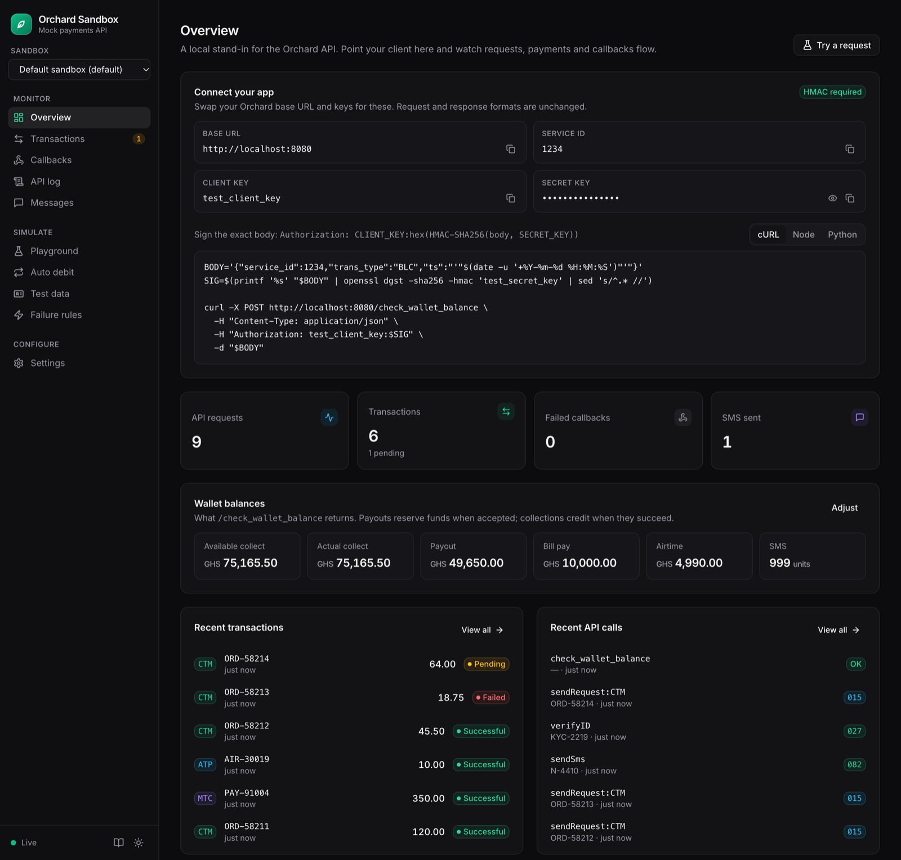

# Orchard Sandbox

A drop-in mock of the [Orchard payments API](https://docs.anmgw.com/docs-page.html) by appsNmobile, with a live dashboard. Test collections, payouts, callbacks, SMS, Ghana Card checks and hosted checkout on your machine or in CI. No whitelisted numbers, no real money.



- **Same contract.** Same endpoints, request fields, HMAC signing and response codes as Orchard. Switch the base URL and keys, nothing else.
- **Real lifecycle.** Payments start pending (`015`), settle, then POST a callback to your `callback_url`, with retries.
- **Controllable.** Test numbers pick outcomes, failure rules simulate outages, and pending payments can be approved or failed by hand.
- **One binary.** Pure Go, about 17 MB as a container, in-memory by default.

## Run it

**Docker**

```bash
docker run --rm -p 8080:8080 ghcr.io/savekirk/orchard-sandbox
```

**Go**

```bash
go install github.com/savekirk/orchard-sandbox@latest
orchard-sandbox
```

**From source** (Go 1.26+, Node 22+)

```bash
git clone https://github.com/savekirk/orchard-sandbox && cd orchard-sandbox
just run        # or: go run .
```

Open <http://localhost:8080> for the dashboard. The API is served from the same address.

## Connect your app

Replace your Orchard settings with:

| Setting | Value |
|---|---|
| Base URL | `http://localhost:8080` (instead of `https://orchard-api.anmgw.com`) |
| Client key | `test_client_key` |
| Secret key | `test_secret_key` |
| Service ID | `1234` |

Sign requests exactly as you would for Orchard:

```bash
BODY='{"service_id":1234,"trans_type":"CTM","exttrid":"ORDER-1001","amount":"10.00","customer_number":"0241234567","nw":"MTN","reference":"Order 1001","callback_url":"http://localhost:3000/orchard/callback","ts":"'"$(date -u '+%Y-%m-%d %H:%M:%S')"'"}'
SIG=$(printf '%s' "$BODY" | openssl dgst -sha256 -hmac 'test_secret_key' | sed 's/^.* //')

curl -X POST http://localhost:8080/sendRequest \
  -H "Content-Type: application/json" \
  -H "Authorization: test_client_key:$SIG" \
  -d "$BODY"
# {"resp_code":"015","resp_desc":"Request successfully received for processing"}
```

About three seconds later the payment succeeds and your `callback_url` receives:

```json
{ "trans_id": "21870173572", "trans_ref": "ORDER-1001", "trans_status": "000/01", "message": "SUCCESS" }
```

No code yet? The dashboard's **Playground** sends signed requests for every endpoint.

## Simulate outcomes

The last digits of the customer, wallet or card number decide what happens:

| Number ends in | Result |
|---|---|
| `000001` | Fails: customer declined |
| `000002` | Fails: insufficient funds |
| `000003` | Fails: invalid account (account inquiry returns `067`) |
| `000004` | Stays pending until you resolve it |
| `000005` | Succeeds, but no callback is sent |
| anything else | Succeeds |

Ghana Cards (`/verifyID`) ending in `-9` are not verified, `-2` expired, `-3` not yet valid, `-4` carry a different name. Register exact cards and account names under **Test data**.

To go further, use **Failure rules** (HTTP 5xx, timeouts, dropped connections, malformed JSON, any `resp_code`) or set settlement to **manual** and approve or fail each payment yourself.

## Use it as a test dependency

**Docker Compose**

```yaml
services:
  orchard:
    image: ghcr.io/savekirk/orchard-sandbox
    ports: ["8080:8080"]

  app:
    build: .
    environment:
      ORCHARD_BASE_URL: http://orchard:8080
      ORCHARD_CLIENT_KEY: test_client_key
      ORCHARD_SECRET_KEY: test_secret_key
    depends_on:
      orchard:
        condition: service_healthy
```

Callbacks are sent from the sandbox container, so use a `callback_url` it can reach, such as `http://app:3000/orchard/callback`.

**GitHub Actions**

```yaml
jobs:
  test:
    runs-on: ubuntu-latest
    services:
      orchard:
        image: ghcr.io/savekirk/orchard-sandbox
        ports: ["8080:8080"]
        env:
          ORCHARD_SANDBOX_SETTLE_DELAY_MS: "0"
```

**Isolated sandboxes.** Give each test suite its own keys, balances and data, then drive it from your tests:

```bash
curl -X POST localhost:8080/mock/runs -d '{"run_id":"checkout-tests","settings":{"settle_mode":"manual"}}'
# returns the sandbox's client_key and secret_key

curl -X POST localhost:8080/mock/runs/checkout-tests/transactions/ORDER-1001/resolve -d '{"status":"FAILED"}'
curl -X POST localhost:8080/mock/runs/checkout-tests/failures -d '{"operation":"sendRequest:CTM","attempt":1,"action":"http_status","http_status":504}'
curl -X POST localhost:8080/mock/runs/checkout-tests/reset
```

Everything the dashboard does is available this way. See the [admin API](docs/reference.md#admin-api).

## Configure

Environment variables cover most needs:

| Variable | Default | |
|---|---|---|
| `ORCHARD_SANDBOX_PORT` (or `PORT`) | `8080` | |
| `ORCHARD_SANDBOX_CLIENT_KEY` | `test_client_key` | |
| `ORCHARD_SANDBOX_SECRET_KEY` | `test_secret_key` | |
| `ORCHARD_SANDBOX_SERVICE_ID` | `1234` | |
| `ORCHARD_SANDBOX_REQUIRE_AUTH` | `true` | `false` accepts unsigned requests |
| `ORCHARD_SANDBOX_SETTLE_MODE` | `auto` | `manual` keeps payments pending until resolved |
| `ORCHARD_SANDBOX_SETTLE_DELAY_MS` | `3000` | Time before an `auto` payment settles |
| `ORCHARD_SANDBOX_LATENCY_MS` | `0` | Extra delay on every response |
| `ORCHARD_SANDBOX_CALLBACK_ATTEMPTS` | `3` | Delivery attempts per callback |
| `ORCHARD_SANDBOX_DB` | in memory | SQLite file to keep data across restarts |
| `ORCHARD_SANDBOX_PUBLIC_URL` | request host | Origin used in checkout links |
| `ORCHARD_SANDBOX_CONFIG` | | YAML file, see [`orchard-sandbox.example.yaml`](orchard-sandbox.example.yaml) |

A config file can also set opening balances and seed Ghana Cards and accounts. Settings can be changed live from the dashboard.

## What's simulated

| Orchard API | Endpoint |
|---|---|
| Collections, payouts, airtime, bills, remittance, account inquiry, GHIPSS | `POST /sendRequest` |
| Transaction status | `POST /checkTransaction` |
| Wallet balances | `POST /check_wallet_balance` |
| SMS | `POST /sendSms` |
| Ghana Card verification | `POST /verifyID` |
| Hosted checkout (card and mobile money page) | `POST /third_party_request` |
| Auto debit mandates and OTP | `POST /autoDebit` |

Validation rules, callback retries and every response code are listed in the [reference](docs/reference.md).

The sandbox does not check IP whitelisting (add a `resp_code` `100` failure rule to test it), and auto debit cycles run when you trigger them rather than on a calendar.

## Develop

```bash
just test       # Go tests
just dev-web    # dashboard with hot reload, against a sandbox on :8080
just build      # bin/orchard-sandbox with the dashboard embedded
just docker     # container image
```

The dashboard build in `internal/web/dist` is committed so `go install` works. Run `just build-web` after changing `web/`.
